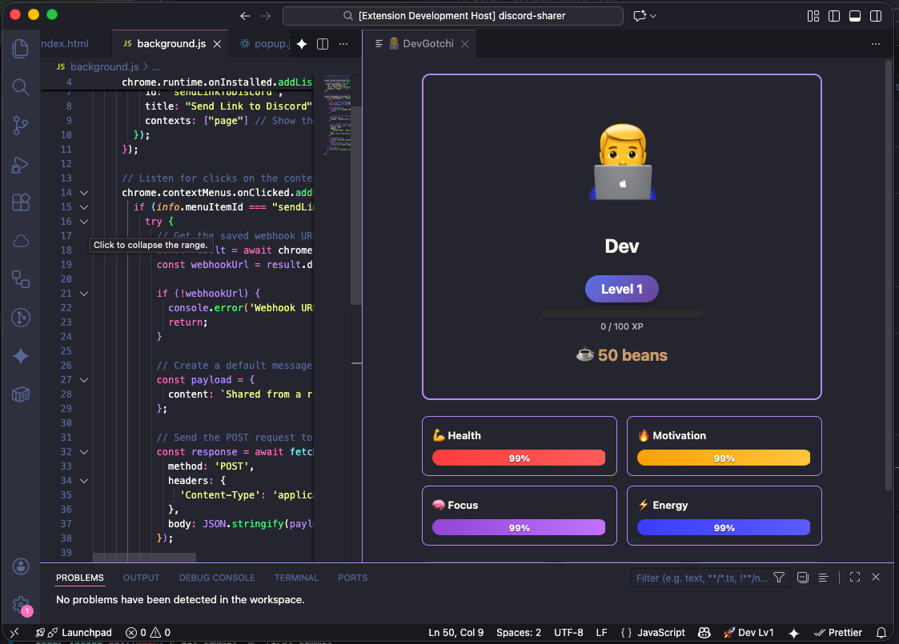

# 👨‍💻 DevGotchi 

**DevGotchi** is a "Developer Tamagotchi" extension for Visual Studio Code. It turns your coding sessions into an RPG-like experience where your productivity, health, and focus are tracked in real-time through a digital developer avatar.

Keep your developer motivated, manage your energy levels, and earn coffee beans by staying productive!

---

## ✨ Key Features

* **Live Developer Avatar:** A dedicated side panel featuring your personal developer who reacts to your coding habits.
* **Dynamic Stats Tracking:** Monitor four core attributes that fluctuate based on your activity:
    * 💪 **Health:** Your overall well-being.
    * 🔥 **Motivation:** Boosted by saving files and completing tasks.
    * 🧠 **Focus:** Affected by long sessions and complexity.
    * ⚡ **Energy:** Depletes over time; requires breaks to refill.
* **The Coffee Economy:** Earn **Coffee Beans** automatically every time you save a file or win challenges. Use them to "recharge" your developer.
* **RPG Leveling System:** Gain XP and level up as you code. Watch your developer grow from a Junior to a Lead.
* **Status Bar Integration:** A quick-glance overview of your level, mood, and health directly in the VS Code status bar.
* **Git Integration:** Earn XP and rewards for commits, merges, and pull requests.
* **The Shop:** Spend Coffee Beans on avatar skins, office furniture, and accessories.
* **Linter Sync:** Your developer's health reacts to real errors and warnings in your code.
* **Skill Trees:** Unlock passive abilities (e.g., "Caffeine Tolerance") to boost your stats.
* **Daily Login Bonus:** Log in every day to earn Coffee Beans and build your streak.
* **Leaderboard:** Compare your level against rival developers.
* **Night Mode:** Your avatar sleeps if you code late at night (10 PM - 6 AM).

---

## 🎮 How to Play

### 1. The Passive Loop
Simply code as you usually do! 
* **Saving Files:** Grants Motivation and earns you `+1 ☕`.
* **Time:** Your energy and focus will naturally decay over time, shifting your mood from **Productive** 🚀 to **Tired** 😴 or **Burnt Out** 🔥.
* **Git Activity:** Commits grant XP. Merges restore massive Motivation!

### 2. Active Management
Open the **DevGotchi Panel** to interact with your dev:
* ☕ **Give Coffee:** Spend beans to instantly boost Energy and Focus.
* 🌴 **Take a Break:** Restore Energy and Health (but watch your Focus dip!).
* 🎯 **Challenges:** Play mini-games like **Bug Hunt**, **Speed Test**, or **Boss Battle** to earn massive XP and Bean rewards.
* ⚡ **Skill Tree:** Unlock passive abilities.
* 🛍️ **Shop:** Buy skins and furniture.
* 🏆 **Leaderboard:** Check your global ranking.

---

## 🚀 Getting Started

1.  Install the extension.
2.  Open the Command Palette (`Ctrl+Shift+P` or `Cmd+Shift+P`).
3.  Run **"DevGotchi: Open Panel"**.
4.  Your developer will appear in the secondary side column.

---

## 🛠 Commands

| Command | Description |
| :--- | :--- |
| `DevGotchi: Open Panel` | Opens the main interaction dashboard. |
| `devgotchi.openPanel` | (Internal) Command bound to the status bar item. |

---

## 🎨 Interface Moods

Your developer's mood changes based on your stats:
* 🚀 **Productive:** High motivation and focus.
* 😰 **Stressed:** Low focus or energy.
* 😴 **Tired:** Very low energy.
* 🔥 **Burnt Out:** Critical health levels.
* ☕ **Caffeinated:** Recently had coffee!
* 💤 **Sleeping:** It's late! Your developer is resting.

---

**Happy Coding!** Keep your developer healthy and your coffee cup full. ☕