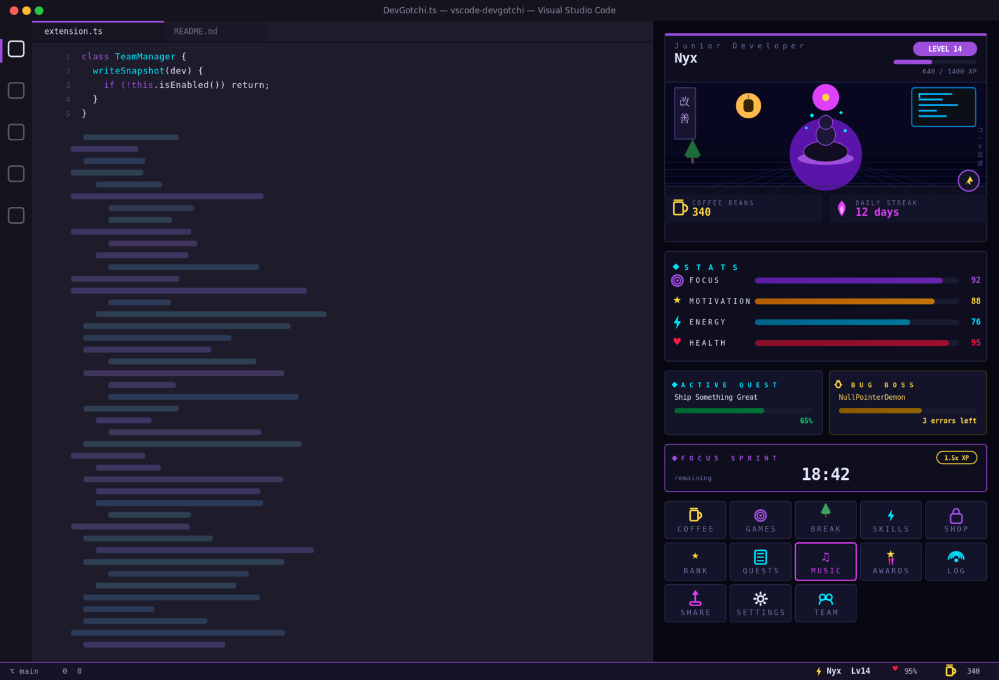
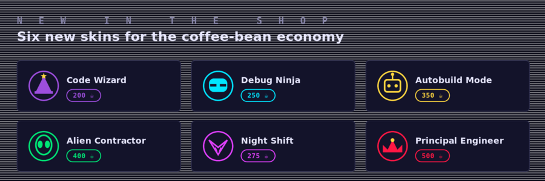

# 👨‍💻 DevGotchi — Gamify Your Coding Sessions

**DevGotchi** turns VS Code into a cyberpunk RPG. It's a free productivity + gamification extension that tracks your focus, energy, and motivation in real time through a living developer avatar — no telemetry, no accounts, no external servers.

Save files and push commits to earn XP and Coffee Beans. Let your stats decay and you'll hit **burnout** — a real mechanic with consequences, not just a number. Level up, build a daily streak, unlock 13 achievements, and become a Legendary Dev.

> *Code is a Martial Art.*



---

## ✨ Features

### 🎮 Core RPG Loop
- **Live Avatar** — Your developer reacts to your coding habits in a dedicated side panel.
- **Four Stats** — Focus 🎯, Motivation ⭐, Energy ⚡, and Health 💪 decay over time and are boosted by activity.
- **XP & Leveling** — Earn XP for saves, commits, and bug fixes. Level up from Junior to Legendary Dev.
- **Coffee Economy** — Coffee Beans are your currency. Earn them by coding, spend them on upgrades.
- **Mood System** — Your developer's mood shifts: 🚀 Productive → 😰 Stressed → 😴 Tired → 💀 Burnt Out.

### ⏱ Focus Sprint
A real Pomodoro-style timer, not just a decoration:
- Start a 15, 25, or 50-minute sprint from the panel or Command Palette (**"DevGotchi: Start Focus Sprint"**).
- Earn **1.5× XP** on everything while it's running, and your Focus stat decays 50% slower.
- Finishing awards a completion bonus (+40 XP, +25 ☕). Cancelling early forfeits it — same incentive as a real Pomodoro.
- A live countdown shows in both the panel and the status bar.

### ☠️ Burnout State
When your health hits zero, **full burnout** kicks in:
- The UI shifts red with a glitch overlay and a critical warning banner.
- Most actions are locked — you can only **Take a Break** or **Drink Coffee** to recover.
- Recovering from burnout earns you the **Back from the Edge** achievement.

### 🐛 Bug Boss
The panel's boss card isn't just decorative — when you have active lint/build errors, it becomes a **real Bug Boss** with HP tied 1:1 to your actual error count:
- More active errors = a bigger, angrier boss (Syntax Wraith → NullPointerDemon → StackOverflow Behemoth → Overwhelmulus).
- Every error you fix does real damage. Clear them all and the Boss is **defeated** — +30 XP, +15 ☕.
- No errors? The card reverts to the standard health-based Burnout Boss.

### 📊 Weekly Recap
Once a week, DevGotchi surfaces a quick summary of what you actually did: XP earned, commits, bugs fixed, focus sprints completed, level progress, and your current streak. Silent if you didn't code that week — no guilt-tripping, just a recap.

### 🏅 Achievements
13 unlockable badges tracking your milestones:

| Badge | How to Earn |
| :--- | :--- |
| ⌨️ First Keystroke | Save your first file |
| 🚀 Ship It | Make your first commit |
| 🔥 Getting Warmed Up | Reach Level 5 |
| 🧘 Code Monk | Reach Level 10 |
| ⚡ Legendary Dev | Reach Level 25 |
| 📅 Week Warrior | 7-day login streak |
| 🏆 Iron Discipline | 30-day login streak |
| 🐛 Exterminator | Fix 50 bugs total |
| 📦 Commit Machine | Make 20 commits |
| ☕ Caffeinated | Earn 500 coffee beans lifetime |
| 💀 Back from the Edge | Recover from full burnout |
| 📜 Quest Master | Complete quests 5 days in a row |
| ⏱️ Deep Work | Complete 10 Focus Sprints |

### ⚡ Random Events
Every 30-second tick, there's a chance of a surprise event — good or bad:
- *"Found a forgotten coffee stash! +20 beans"*
- *"Production incident! −Energy −Motivation"*
- *"Rubber duck debugging breakthrough! +Motivation"*
- *"Git blame points at you. −Motivation"*
- ...and more. Stay on your toes.

### 📡 Activity Log
A live scrollable feed inside the panel showing every recent XP gain, achievement unlock, random event, and level-up — colour-coded by type.

### 🎵 Cyberpunk Music
Procedurally synthesised ambient music generated entirely with the Web Audio API (no external files):
- Driving kick & hi-hat pattern
- Walking A-minor bass line
- Pentatonic arpeggio with stereo movement
- Slow-swelling pad chords every 2 bars
- Sparse synth lead phrase every 4 bars

Toggle it on/off with the **🎵 Music** button. Fades in and out smoothly.

### 📜 Daily Quests
Three randomised quests refresh each day:
- Save files, push commits, fix bugs, or log coding time.
- Completing all three awards a streak bonus that grows over consecutive days.

### 🎯 Mini-Games (Challenges)
| Game | Description |
| :--- | :--- |
| 🐛 Bug Hunt | Click bugs before they vanish — 20 second frenzy |
| ⚡ Speed Test | Type a code snippet as fast as possible |
| 👾 Boss Battle | Type snippets to deal damage before time runs out (not to be confused with the real 🐛 **Bug Boss** on the main panel — that one's tied to your actual lint errors) |

### ⚡ Skill Tree
Unlock passive abilities with Coffee Beans:
- **Caffeine Tolerance** — Coffee restores 50% more energy
- **Iron Focus** — Focus decays 30% slower
- **Bug Slayer** — Earn 2× XP when fixing bugs

### 🛍️ Shop
Spend beans on skins and gear that affect your stats:



- Business Suit 🕴️, Space Suit 👨‍🚀, Code Wizard 🧙, Debug Ninja 🥷, Autobuild Mode 🤖, Alien Contractor 👽, Night Shift 🧛, Principal Engineer 🤴
- Ergo Chair (energy decays slower), Mech Keyboard (motivation decays slower)
- Equipped skins show up everywhere your avatar does — the panel, and the exported Share Stats Card.

### 📅 Activity Calendar
A GitHub-contribution-graph-style heatmap on the main panel, showing your last year of DevGotchi activity at a glance — every XP-earning action (saves, commits, bug fixes, quests, boss defeats) lights up that day's cell. Drawn straight to canvas, no server, no separate tracking to opt into.

### 🔗 IDE Integrations
- **Status Bar** — Level, mood emoji, and stat summary always visible.
- **Git** — Commits award +50 XP and +5 beans automatically.
- **Linter** — Fixing errors awards XP; active errors slowly drain your stats.

### 📤 Share Stats Card
Turn your progress into something you can actually show people:
- **📋 Copy as Markdown** — a ready-to-paste stats block (level, streak, stats, achievement count) for your GitHub profile README or a PR description.
- **🖼️ Save as Image** — a cyberpunk-styled PNG stats card, rendered client-side and saved wherever you like — good for posting your progress on social media.
- Both are zero-telemetry: everything is generated locally in the panel, nothing leaves your machine except the file you choose to save or the text you choose to paste.

### ⚙️ Settings
A new Settings button on the panel (and `DevGotchi: Open Settings`) lets you tune the experience:
- **Weekly Recap notifications** — turn the weekly summary popup on/off (it still logs to the Activity Log either way).
- **Reduce achievement notifications** — suppress achievement-unlock popups if they feel like noise; achievements still unlock and log normally.
- **Stat decay speed** — Relaxed, Normal, or Intense, for a more forgiving or more high-stakes pace.

### 💾 Progress Export/Import
Your progress lives in VS Code's local storage, but you can move or back it up:
- **`DevGotchi: Export Progress`** — saves your full save (stats + settings) as a portable JSON file.
- **`DevGotchi: Import Progress`** — restores from a previously exported file, after an explicit confirmation since it overwrites your current save.
- Both are also available as buttons inside the Settings panel. Fully local — no accounts, no server round-trip.

### 🌴 Vacation Mode
Going away for a few days shouldn't cost you your streak or leave your dev burnt out when you get back:
- Toggle it in Settings (or `DevGotchi: Toggle Vacation Mode`) — takes effect immediately.
- While on: stat decay, burnout, and streak-breaking are all frozen. A banner on the panel reminds you it's active.
- Turn it off when you're back and everything resumes exactly where it left off — no penalty for the time away.

### 💬 Feedback
A "Send Feedback / Report a Bug" link at the bottom of the Settings panel (and `DevGotchi: Send Feedback`) opens the GitHub issues page directly — the fastest way to reach me with bugs or ideas.

### 👥 Team Mode
See your teammates' progress without any server, accounts, or DevGotchi backend — it's synced entirely through git:
- Turn it on in Settings (or `DevGotchi: Toggle Team Mode`). Only available for repos with more than one contributor.
- Your progress gets written to `.devgotchi/team/<you>.json` inside the repo. DevGotchi never runs git commands that change anything — you commit and push it yourself, the same way you already share every other file.
- A new 👥 Team button opens a view of everyone who's enabled it: name, level, and streak, pulled from whatever's currently on disk (as fresh as your last `git pull`).
- **Team Raid Boss**: once there's more than one teammate, the Team view also shows a shared HP bar — the whole team's combined active error count. Clear it together (drive the combined count to 0) and the first person to check the Team view after that gets a bonus (+25 XP, +20 ☕), then a fresh fight starts.
- Worth knowing: this makes your stats visible to anyone with access to the repo — it's an explicit opt-in, not a default.

---

## 🚀 Getting Started

1. Install the extension.
2. Open the Command Palette (`Ctrl+Shift+P` / `Cmd+Shift+P`).
3. Run **"DevGotchi: Open Panel"**.
4. Your developer appears in the side column. A tutorial walks you through each feature.

---

## 🛠 Commands

| Command | Description |
| :--- | :--- |
| `DevGotchi: Open Panel` | Opens the main dashboard |
| `DevGotchi: Reset Progress` | Wipe all progress and start fresh |
| `DevGotchi: Start Focus Sprint (Pomodoro)` | Start a 15/25/50-minute focus sprint for 1.5x XP |
| `DevGotchi: Cancel Focus Sprint` | Cancel the current sprint early (no completion bonus) |
| `DevGotchi: Export Stats Card` | Open the panel and bring up the shareable stats card |
| `DevGotchi: Open Settings` | Open the panel and bring up the Settings modal |
| `DevGotchi: Export Progress` | Save your full progress + settings to a JSON file |
| `DevGotchi: Import Progress` | Restore progress + settings from a previously exported file |
| `DevGotchi: Toggle Vacation Mode` | Freeze/unfreeze stat decay and your streak |
| `DevGotchi: Send Feedback` | Open the GitHub issues page to report a bug or suggest a feature |
| `DevGotchi: Toggle Team Mode` | Turn Team Mode on/off for this workspace |
| `DevGotchi: Open Team View` | Open the panel and bring up the Team view |

---

## 🎨 Panel Layout

```
┌─────────────────────────────────────┐
│  Avatar │ Name · Role               │
│         │ LEVEL N  ████░░ XP        │
│         │ ☕ Beans   🔥 Streak      │
├─────────────────────────────────────┤
│ ◈ Stats                             │
│  🎯 Focus      ████████░░  82       │
│  ⭐ Motivation ██████░░░░  65       │
│  ⚡ Energy     ████░░░░░░  42       │
│  💪 Health     ██████████  100      │
├──────────────────┬──────────────────┤
│ ◈ Active Quest  │ ☠/🐛 Boss Card   │
│  Ship Something │  Overwhelmulus    │
│  ████░░ 60%     │  ██████░░ 300 HP  │
├─────────────────────────────────────┤
│ ◈ Focus Sprint      [1.5x XP]      │
│         18:42 remaining            │
├─────────────────────────────────────┤
│ ☕ 🎯 🌴 ⚡ 🛍️ 🏆 📜 🎵 🏅 📡 📤 ⚙️ 👥│  (👥 only shows for a shared repo)
└─────────────────────────────────────┘
```

---

**Happy Coding.** Keep your developer alive, your streak unbroken, and your coffee cup full. ☕
