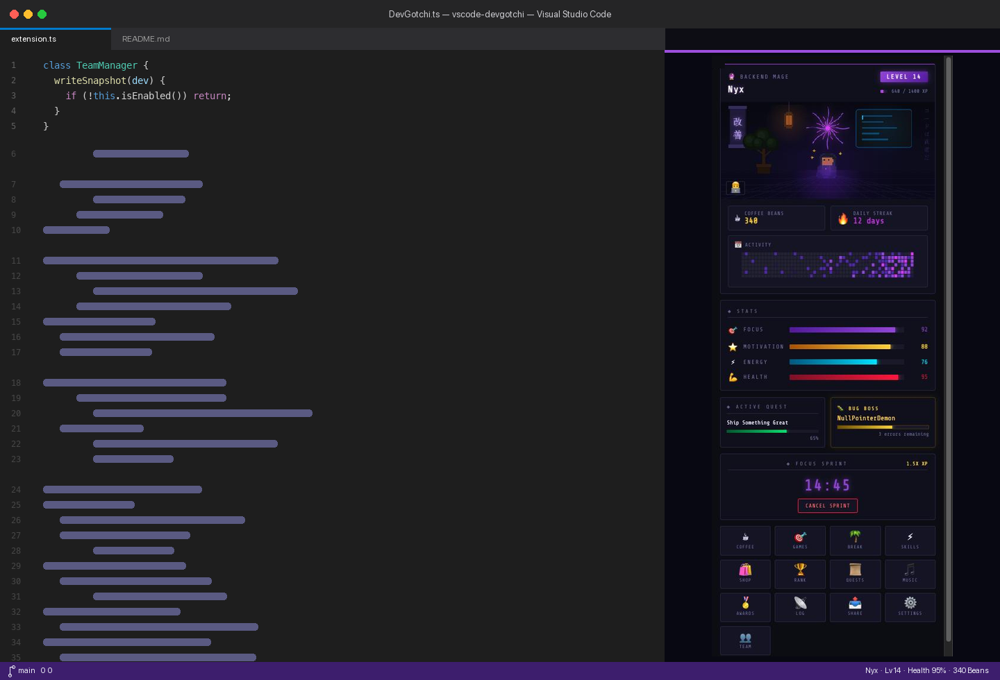
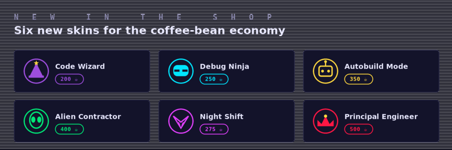

# 👨‍💻 DevGotchi — Gamify Your Coding Sessions

**DevGotchi** turns VS Code into a cyberpunk RPG. It's a free productivity + gamification extension that tracks your focus, energy, and motivation in real time through a living developer avatar — no telemetry, no accounts, no external servers.

Save files and push commits to earn XP and Coffee Beans. Let your stats decay and you'll hit **burnout** — a real mechanic with consequences, not just a number. Level up, build a daily streak, unlock 15 achievements, fight three real bosses tied to your actual repo state, and Prestige once you hit the cap.

> *Code is a Martial Art.*



---

## ✨ Features

### 🎮 Core RPG Loop
- **Live Avatar** — Your developer reacts to your coding habits in a dedicated side panel.
- **Four Stats** — Focus 🎯, Motivation ⭐, Energy ⚡, and Health 💪 decay over time and are boosted by activity.
- **XP & Leveling** — Earn XP for saves, commits, and bug fixes. Level up from Junior to Legendary Dev.
- **Coffee Economy** — Coffee Beans are your currency. Earn them by coding, spend them on upgrades.
- **Mood System** — Your developer's mood shifts: 🚀 Productive → 😰 Stressed → 😴 Tired → 💀 Burnt Out.

### 🧙 Character Classes
Pick a class the first time you open the panel — it's free, and it sets a permanent passive bonus:

| Class | Passive |
| :--- | :--- |
| 🔮 Backend Mage | Git commits channel extra power: +25% XP from commits |
| 🗡️ Frontend Rogue | Fast and precise: +25% XP from file saves |
| 🛡️ DevOps Paladin | Built for uptime: energy & motivation decay 15% slower |

Your class also retints your avatar in the panel scene (hoodie + glow color), so your build is visible at a glance. Changed your mind? Respec anytime from the Shop for 200 ☕.

### ⏱ Focus Sprint
A real Pomodoro-style timer, not just a decoration:
- Start a 15, 25, or 50-minute sprint from the panel or Command Palette (**"DevGotchi: Start Focus Sprint"**).
- Earn **1.5× XP** on everything while it's running, and your Focus stat decays 50% slower.
- Finishing awards a completion bonus (+40 XP, +25 ☕). Cancelling early forfeits it — same incentive as a real Pomodoro.
- A live countdown shows in both the panel and the status bar.

### ☠️ Burnout State
When your health hits zero, **full burnout** kicks in:
- The UI shifts red with a glitch overlay and a critical warning banner.
- Most actions are locked — you can only **Take a Break** or **Drink Coffee** to recover.
- Recovering from burnout earns you the **Back from the Edge** achievement.

### 😴 Idle Detection
Going to lunch shouldn't tank your stats. If there's no real editor activity (typing, cursor movement, switching files, regaining window focus) for 10 minutes, DevGotchi reads that as AFK — stat decay pauses and your avatar visibly falls asleep instead of draining the whole time you're away from the keyboard. The moment you're back, everything resumes normally.

### 👾 Boss Fights
The panel's boss card isn't just decorative — it becomes a **real boss** tied to your actual repo/editor state, not a simulated fight. Three bosses share the card, in priority order (highest shown when more than one is active):

1. **🐙 Merge Conflict Kraken** — HP is the real count of files with unresolved git merge conflicts (Conflict Tentacle → Merge Kraken → Rebase Leviathan → Git Cthulhu). A live conflict blocks work, so it always takes priority.
2. **🐛 Bug Boss** — HP is tied 1:1 to your actual active lint/build error count (Syntax Wraith → NullPointerDemon → StackOverflow Behemoth → Overwhelmulus). Fixing an error does real damage; the soundtrack itself intensifies as this one grows — see **🎵 Cyberpunk Music** below.
3. **🧟 Code Smell Boss** — HP is the count of currently-open files over 300 lines (Spaghetti Sprite → Code Smell Ooze → Legacy Behemoth → Technical Debt Titan). Only scans files you actually have open, not the whole repo. The lowest-priority boss — it only shows once nothing more urgent is going on, matching "the chore everyone postpones."

Clearing any of them to 0 **defeats the boss** for a bonus (+30 XP, +15 ☕), and counts toward your lifetime bosses-slain total (see **🎁 Year in Code Wrapped**). No active boss? The card reverts to the standard health-based Burnout Boss.

### 📊 Weekly Recap
Once a week, DevGotchi surfaces a quick summary of what you actually did: XP earned, commits, bugs fixed, focus sprints completed, level progress, and your current streak. Silent if you didn't code that week — no guilt-tripping, just a recap. The notification includes a **Share Recap** action that turns it into the shareable Weekly Recap card (see **Share Your Progress** below).

### 🏅 Achievements
15 unlockable badges tracking your milestones:

| Badge | How to Earn |
| :--- | :--- |
| ⌨️ First Keystroke | Save your first file |
| 🚀 Ship It | Make your first commit |
| 🔥 Getting Warmed Up | Reach Level 5 |
| 🧘 Code Monk | Reach Level 10 |
| ⚡ Legendary Dev | Reach Level 25 |
| 📅 Week Warrior | 7-day login streak |
| 🏆 Iron Discipline | 30-day login streak |
| 🐛 Exterminator | Fix 50 bugs total |
| 📦 Commit Machine | Make 20 commits |
| ☕ Caffeinated | Earn 500 coffee beans lifetime |
| 💀 Back from the Edge | Recover from full burnout |
| 📜 Quest Master | Complete quests 5 days in a row |
| ⏱️ Deep Work | Complete 10 Focus Sprints |
| ❓❓ 2 Secret Achievements | Hidden until you unlock them — shown as "???" in the Awards list. Keep coding and find out. |

### 🌟 Prestige
Leveling caps at **Level 50**. Once you hit it, a 🌟 PRESTIGE button appears — resets you back to Level 1 ("Junior Developer" again) in exchange for a permanent, stacking **+5% XP bonus** per prestige. Your lifetime stats, streak, achievements, and inventory are untouched; only level/XP resets. The classic idle-game retention loop, now with your actual coding activity behind it.

### ⚡ Random Events
Every 30-second tick, there's a chance of a surprise event — good or bad:
- *"Found a forgotten coffee stash! +20 beans"*
- *"Production incident! −Energy −Motivation"*
- *"Rubber duck debugging breakthrough! +Motivation"*
- *"Git blame points at you. −Motivation"*
- ...and more. Stay on your toes.

### 📡 Activity Log
A live scrollable feed inside the panel showing every recent XP gain, achievement unlock, random event, and level-up — colour-coded by type. A **📋 Standup** button right in the log header turns today's entries into a ready-to-paste "what I did today" post (see **Share Your Progress** below).

### 🎵 Cyberpunk Music
Procedurally synthesised ambient music generated entirely with the Web Audio API (no external files):
- Driving kick & hi-hat pattern
- Walking A-minor bass line
- Pentatonic arpeggio with stereo movement
- Slow-swelling pad chords every 2 bars
- Sparse synth lead phrase every 4 bars

**Dynamic Boss Music**: the whole mix intensifies as the Bug Boss grows — double-time kicks, a brighter/louder bass and arp, urgent 16th-note fills, and a low pulsing alarm siren once it's past 80% HP. The 🎵 icon flips to 👾 while it's playing in boss mode.

Toggle it on/off with the **🎵 Music** button. Fades in and out smoothly.

### 📜 Daily Quests
Three randomised quests refresh each day:
- Save files, push commits, fix bugs, or log coding time.
- Completing all three awards a streak bonus that grows over consecutive days.

### 📅 Daily Login Calendar
A new 📅 Calendar view overlays a repeating 30-day cycle on top of your login streak — log in on consecutive days to climb the calendar, and **Day 30 of every cycle pays a big one-time bonus** (+100 XP, +100 ☕) on top of your normal daily reward.

### 📖 The Legacy Code Dungeon
A 7-chapter narrative questline, reachable from the new 📖 Story button. Each chapter is one objective (save/commit/fix/time — the same shape as a daily quest) wrapped in its own flavor text:

1. The Crumbling Entrance
2. Whispers in the Changelog
3. The Dependency Crypt
4. Echoes of Deprecated Code
5. The Merge Conflict Labyrinth
6. The Refactor's Reckoning
7. The Legacy Core

Completing a chapter's objective starts a **next-day gate** — the following chapter only unlocks once a new calendar day begins, so the full arc plays out over at least 7 real days instead of being grindable in one sitting. Finish all 7 and you earn the exclusive 💀 Legacy Slayer skin.

### 🎁 Community Quest Packs
Import a shareable set of themed quests — plain JSON, no code, ever:
- **`DevGotchi: Import Quest Pack from File`** — zero network calls, the default way to import.
- **`DevGotchi: Import Quest Pack from URL`** — opt-in, with an explicit confirmation dialog disclosing the exact URL before anything is fetched. This is the *only* thing in DevGotchi that ever makes a network request, and only when you ask it to.
- Every field is strictly validated (bounded targets/rewards, allow-listed quest types) and HTML-escaped before it's ever stored, since this is the one place DevGotchi consumes content someone else wrote.
- Two example packs ship in this repo's [`quest-packs/`](quest-packs/) folder — **100 Days of Code** and a **Hacktoberfest Quest Pack** (a separate, stackable coffee-bean track from the built-in seasonal Hacktoberfest event, which has its own exclusive skin). Point someone at a raw GitHub URL to one of these (or write your own) to share it.
- Imported quests show in a new 🎁 Quest Packs section of the Quests modal, with a "remove" link per pack.

### 🎲 Boss Affixes
A Diablo-rift-style weekly mutator, shown as a banner on the panel — deterministically picked from the ISO week number, so it changes automatically every Monday with no server, no scheduling, and no persisted state. Mostly positive/flavorful (Sprint Surge, Boss Rush, Quest Rally, Iron Streak, Slow Burn, Caffeine Week), plus one that ties into something you already control directly: **Double Trouble**, where active bugs drain stats twice as fast.

### 💼 Timesheet Mode
A new **📊 Export Timesheet** button in Settings exports your real coding time as a billable-hours CSV. It's tracked the same "ignore offline/idle time" way quest time already was, so it reads as actual coding time, not just "VS Code was open" time. Pick a range (7/30/90 days, or all tracked history) and get a `Date,Hours` CSV — no rate applied, just honest hours to plug into your own invoicing.

### 🎯 Mini-Games (Challenges)
| Game | Description |
| :--- | :--- |
| 🐛 Bug Hunt | Click bugs before they vanish — 20 second frenzy |
| ⚡ Speed Test | Type a code snippet as fast as possible |
| 👾 Boss Battle | Type snippets to deal damage before time runs out (not to be confused with the real 🐛 **Bug Boss** on the main panel — that one's tied to your actual lint errors) |

### ⚡ Skill Tree
Unlock passive abilities with Coffee Beans:
- **Caffeine Tolerance** — Coffee restores 50% more energy
- **Iron Focus** — Focus decays 30% slower
- **Bug Slayer** — Earn 2× XP when fixing bugs

### 🛍️ Shop
Spend beans on skins and gear that affect your stats:



- Business Suit 🕴️, Space Suit 👨‍🚀, Code Wizard 🧙, Debug Ninja 🥷, Autobuild Mode 🤖, Alien Contractor 👽, Night Shift 🧛, Principal Engineer 🤴
- Ergo Chair (energy decays slower), Mech Keyboard (motivation decays slower)
- Equipped skins show up everywhere your avatar does — the panel, and every shareable card.
- **Class Respec** — switch your Character Class for 200 ☕, right from the same Shop list.

### 📅 Activity Calendar
A GitHub-contribution-graph-style heatmap on the main panel, showing your last year of DevGotchi activity at a glance — every XP-earning action (saves, commits, bug fixes, quests, boss defeats) lights up that day's cell. Drawn straight to canvas, no server, no separate tracking to opt into.

### 🎉 Seasonal Events
A year-round calendar of recurring, time-boxed events — each lives automatically every year on the same real-world date(s), no manual reset needed:

| Event | Window | Goal | Skin |
| :--- | :--- | :--- | :--- |
| 🥧 Pi Day | March 14 | Ship 3 commits | 3.14 Coder |
| 🤡 April Fools' | April 1 | Just have DevGotchi open that day | Prankster |
| 🌌 May the 4th | May 4 | Fix 5 bugs | Jedi Debugger |
| 🏖️ Summer Hack Season | June–August | Complete 10 Focus Sprints | Code Beach |
| 💾 Programmer's Day | Sept 13 | Make 1 commit | 256 Club |
| 🎃 Hacktoberfest | October | Merge 4 pull requests (detected from local git history — no account or API access needed) | Hacktoberfest Hunter |
| 🎄 Debug the Halls | December | Fix 25 bugs | Holiday Debugger |

Every skin is limited — earned only, never purchasable. A themed banner appears on the panel while its event is active, with progress also shown in the Quests modal; both disappear once the window ends.

### 🔗 IDE Integrations
- **Status Bar** — Level, mood emoji, and stat summary always visible.
- **Git** — Commits award +50 XP and +5 beans automatically.
- **Linter** — Fixing errors awards XP; active errors slowly drain your stats.

### 📤 Share Your Progress
Four shareable cards, all rendered locally — zero telemetry, nothing leaves your machine except the file you choose to save or the text you choose to paste:
- **🕹️ Stats Card** — a cyberpunk-styled PNG of your level, XP, streak, and lifetime stats.
- **📊 Weekly Recap** — a GitHub-contribution-graph-style card of your last year of activity, with this week's XP/commits/bugs fixed/focus sprints called out and the current 7-day column outlined.
- **🎁 Year in Code Wrapped** — a Spotify-Wrapped-style annual card: lifetime total XP, bosses slain, longest streak ever, and your most productive coding hour (with a flavor tag like Night Owl 🦉 or Early Bird 🐦). Fires as a one-time notification roughly once a year; reopen anytime from this tab.
- **📋 Standup** — turns today's Activity Log into a ready-to-paste "what I did today" post for Slack, your class/avatar emoji included.

**🐦 Flex This** does both halves of a post in one click: copies a pre-written, hashtag-ready caption to your clipboard and immediately prompts to save the matching card image — paste the caption, attach the image, done.

The classic options are still there for the Stats Card and Weekly Recap: **📋 Copy as Markdown** (a stats block for your GitHub profile README or a PR description) and **🖼️ Save as Image** (just the PNG, no caption).

### ⚙️ Settings
A new Settings button on the panel (and `DevGotchi: Open Settings`) lets you tune the experience:
- **Weekly Recap notifications** — turn the weekly summary popup on/off (it still logs to the Activity Log either way).
- **Reduce achievement notifications** — suppress achievement-unlock popups if they feel like noise; achievements still unlock and log normally.
- **Stat decay speed** — Relaxed, Normal, or Intense, for a more forgiving or more high-stakes pace.

### 💾 Progress Export/Import
Your progress lives in VS Code's local storage, but you can move or back it up:
- **`DevGotchi: Export Progress`** — saves your full save (stats + settings) as a portable JSON file.
- **`DevGotchi: Import Progress`** — restores from a previously exported file, after an explicit confirmation since it overwrites your current save.
- Both are also available as buttons inside the Settings panel. Fully local — no accounts, no server round-trip.

### 🌴 Vacation Mode
Going away for a few days shouldn't cost you your streak or leave your dev burnt out when you get back:
- Toggle it in Settings (or `DevGotchi: Toggle Vacation Mode`) — takes effect immediately.
- While on: stat decay, burnout, and streak-breaking are all frozen. A banner on the panel reminds you it's active.
- Turn it off when you're back and everything resumes exactly where it left off — no penalty for the time away.

### 💬 Feedback
A "Send Feedback / Report a Bug" link at the bottom of the Settings panel (and `DevGotchi: Send Feedback`) opens the GitHub issues page directly — the fastest way to reach me with bugs or ideas.

### 💖 Buy the Dev a Coffee
A 💖 **Sponsor** button in the action grid (and another link in Settings) opens GitHub Sponsors and, once per day, grants a small in-game coffee-bean bonus (+25 ☕) just for checking it out. There's no way for a VS Code extension to verify an actual sponsorship, so this deliberately rewards clicking through, not paying — monetization framed as a game mechanic, never a paywall. DevGotchi stays free forever either way.

### 👥 Team Mode
See your teammates' progress without any server, accounts, or DevGotchi backend — it's synced entirely through git:
- Turn it on in Settings (or `DevGotchi: Toggle Team Mode`). Only available for repos with more than one contributor.
- Your progress gets written to `.devgotchi/team/<you>.json` inside the repo. DevGotchi never runs git commands that change anything — you commit and push it yourself, the same way you already share every other file.
- A new 👥 Team button opens a view of everyone who's enabled it: name, level, and streak, pulled from whatever's currently on disk (as fresh as your last `git pull`).
- **Team Raid Boss**: once there's more than one teammate, the Team view also shows a shared HP bar — the whole team's combined active error count. Clear it together (drive the combined count to 0) and the first person to check the Team view after that gets a bonus (+25 XP, +20 ☕), then a fresh fight starts.
- Worth knowing: this makes your stats visible to anyone with access to the repo — it's an explicit opt-in, not a default.

---

## 🚀 Getting Started

1. Install the extension.
2. Open the Command Palette (`Ctrl+Shift+P` / `Cmd+Shift+P`).
3. Run **"DevGotchi: Open Panel"**.
4. Your developer appears in the side column. A tutorial walks you through each feature.

---

## 🛠 Commands

| Command | Description |
| :--- | :--- |
| `DevGotchi: Open Panel` | Opens the main dashboard |
| `DevGotchi: Reset Progress` | Wipe all progress and start fresh |
| `DevGotchi: Start Focus Sprint (Pomodoro)` | Start a 15/25/50-minute focus sprint for 1.5x XP |
| `DevGotchi: Cancel Focus Sprint` | Cancel the current sprint early (no completion bonus) |
| `DevGotchi: Export Stats Card` | Open the panel and bring up the shareable stats card |
| `DevGotchi: Share Weekly Recap` | Open the panel and bring up the Weekly Recap share card |
| `DevGotchi: Share Year in Code Wrapped` | Open the panel and bring up the Year in Code Wrapped share card |
| `DevGotchi: Choose / Respec Class` | Pick your class for the first time, or pay 200 ☕ to switch it later |
| `DevGotchi: Open Settings` | Open the panel and bring up the Settings modal |
| `DevGotchi: Export Progress` | Save your full progress + settings to a JSON file |
| `DevGotchi: Import Progress` | Restore progress + settings from a previously exported file |
| `DevGotchi: Export Timesheet (billable hours CSV)` | Export your tracked coding time as a Date/Hours CSV |
| `DevGotchi: Import Quest Pack from File` | Import a community Quest Pack JSON file — no network call |
| `DevGotchi: Import Quest Pack from URL` | Import a Quest Pack from a URL, after an explicit confirmation |
| `DevGotchi: Toggle Vacation Mode` | Freeze/unfreeze stat decay and your streak |
| `DevGotchi: Send Feedback` | Open the GitHub issues page to report a bug or suggest a feature |
| `DevGotchi: Support DevGotchi on GitHub Sponsors` | Opens GitHub Sponsors (+25 ☕ once/day for checking it out) |
| `DevGotchi: Prestige (reset Level for a permanent XP badge)` | Once you're Level 50, reset to Level 1 for a permanent +5% XP badge |
| `DevGotchi: Toggle Team Mode` | Turn Team Mode on/off for this workspace |
| `DevGotchi: Open Team View` | Open the panel and bring up the Team view |

---

## 🎨 Panel Layout

```
┌──────────────────────────────────-───┐
│  Avatar │ Name · Role                │
│         │ LEVEL N  ████░░ XP         │
│         │ ☕ Beans   🔥 Streak        │
├───────────────────────────────-──────┤
│ ◈ Stats                              │
│  🎯 Focus      ████████░░  82        │
│  ⭐ Motivation ██████░░░░  65        │
│  ⚡ Energy     ████░░░░░░  42         │
│  💪 Health     ██████████  100       │
├──────────────────┬───────────────-───┤
│ ◈ Active Quest  │ ☠/🐛/🐙/🧟 Boss    │
│  Ship Something │  Overwhelmulus     │
│  ████░░ 60%     │  ██████░░ 300 HP   │
├────────────────────────────────────-─┤
│ ◈ Focus Sprint      [1.5x XP]        │
│         18:42 remaining              │
├─────────────────────────────────────-┤
│ ☕ 🎯 🌴 ⚡ 🛍️ 🏆 📜 🎵 🏅 📅 📖 📡 📤 ⚙️ 👥 💖│  (👥 only shows for a shared repo)
└─────────────────────────────────────┘
```

---

## 🗺️ Roadmap

Ideas being considered, not yet built:
- **Raid Boss MVP** — show each teammate's bug-fix contribution during a Team Raid Boss fight, with an "MVP" tag for whoever cleared the most.
- **Code Smell Boss, function-length mode** — the current boss only counts bloated *files* (300+ lines); flagging individual bloated *functions* needs real per-language parsing and is a bigger, separate build.

Have an idea? Use `DevGotchi: Send Feedback` — that's what it's there for.

---

## ⭐ Enjoying DevGotchi?

A rating on the Marketplace is the single biggest thing that helps a free extension like this get discovered. If your developer is still alive, consider leaving one — it takes 20 seconds.

Found a bug or want a feature? [Open an issue](https://github.com/johnfacey/vscode-devgotchi/issues) — I read every one.

---

**Happy Coding.** Keep your developer alive, your streak unbroken, and your coffee cup full. ☕
